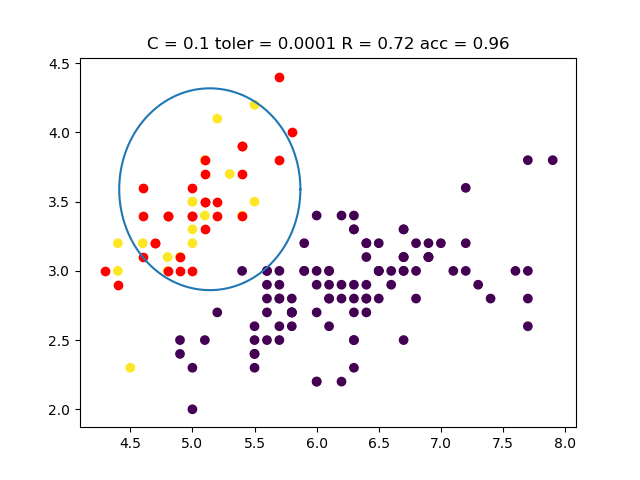
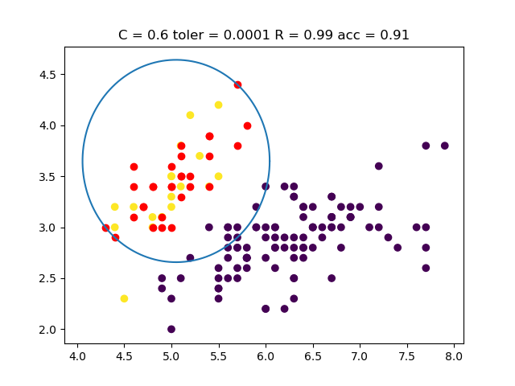

# One Class Model(svdd)

## 1. 如何运行
---
#### 1.1 开发环境
Python3.7.3

Lib: numpy, matplotlib

#### 1.2 运行
位于`src\`文件夹根目录下：

`python main.py`

程序将会运行不同模型，显示结果的对比,可以修改`main.py`中`adjust_param()`函数中参数使模型适配不同的iris类别，与参数值的调整。

#### 1.3 运行结果

程序运行后，会依次显示两张图片，分别是

* 在特征是二维情况下，以第一类数据训练模型，C=0.1时的测试结果。其中，红色点代表训练数据，黄色点代表正样本，紫色点代表负样本。


* 其余条件相同，C=0.6时模型结果。



## 2. 项目结构
---

```

│─README.md
│
├─data
│      iris.data
│
├─img
│      Figure_1.png
│      Figure_2.png
│
├─doc       //实验报告
|
├─src
   │  main.py         //数据预处理，模型参数调整及绘图
   │  one_class_svm.py          //svm实现
   │  load_data.py           //读取数据
   │
   └─__pycache__

```